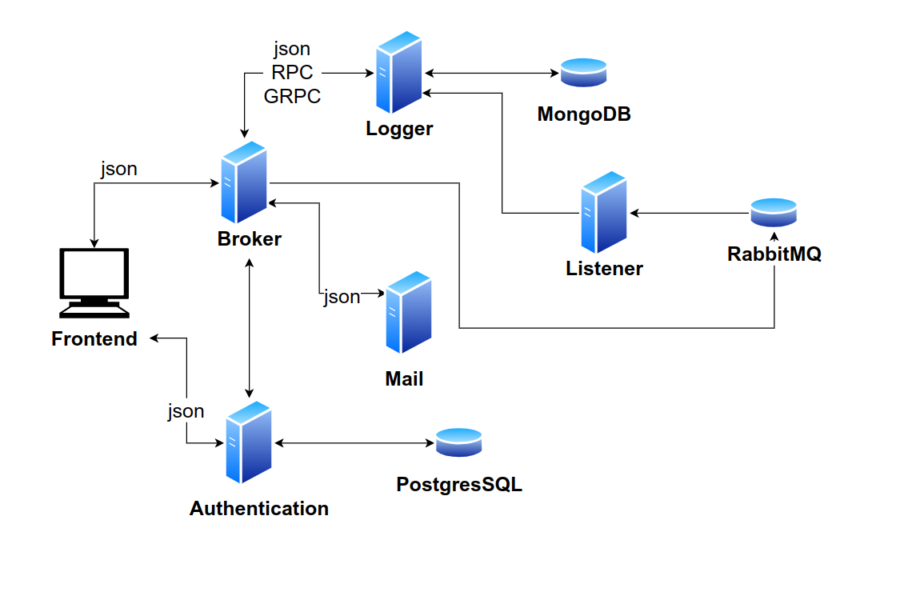

# Readme

This is just a **work in progress** learning project (written in `golang 1.18`) and mostly a proof-of-concept I used to understand better microservices interactions.

The frontend is extremely simple because there was no use to make it cool.

Tests on the way (IF I find the time).

## How to run

Run `make up_build` (for the backend microservices) and `make build_front` (for the frontend), than wait for docker images to start. 

The image containing RabbitMQ is the slower to start so check its logs.

## List of microservices

- authentication: manages very simple user authentication hitting on a `postgres` database
- broker: manages the main interactions between other microservices and fe
- listener: listen to `rabbitmq` and send messages to other microservices (atm only to logger)
- logger: logs messages received from other microservices into a `mongodb` database
- mail: sends emails in response to messages received from other microservices (they are sent to `mailhog` to test they are correctly received)

